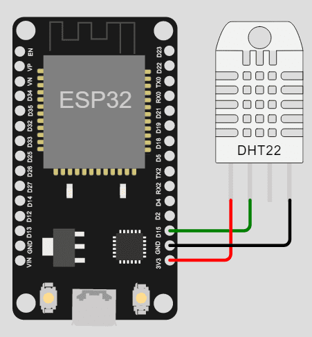

# Proyecto de Monitoreo de Temperatura y Humedad con Telegram Bot

Este proyecto utiliza un sensor DHT22 para monitorear la temperatura y la humedad, y envía alertas y datos a través de un bot de Telegram. El código está diseñado para ser ejecutado en un ESP32, que se conecta a una red Wi-Fi y utiliza la API de Telegram para enviar y recibir mensajes.

  

## Características

- **Monitoreo en tiempo real**: Lee la temperatura y la humedad del sensor DHT22.
- **Alertas automáticas**: Envía alertas a los usuarios de Telegram si la temperatura supera un umbral predefinido (24 °C).
- **Reconexión automática**: Verifica y reconecta automáticamente la conexión Wi-Fi si se pierde.
- **Interacción con el bot**: Los usuarios pueden solicitar datos de temperatura y humedad en cualquier momento mediante comandos de Telegram.

## Requisitos

### Hardware
- ESP32
- Sensor DHT22
- Conexiones eléctricas adecuadas (cables, resistencias, etc.)

### Software
- Arduino IDE
- Bibliotecas necesarias:
  - `DHT` (para el sensor DHT22)
  - `WiFi` (para la conexión Wi-Fi)
  - `WiFiClientSecure` (para conexiones seguras)
  - `UniversalTelegramBot` (para interactuar con el bot de Telegram)

## Configuración

1. **Clona este repositorio** en tu entorno local.
2. **Abre el proyecto** en Arduino IDE.
3. **Instala las bibliotecas necesarias** desde el Gestor de Bibliotecas de Arduino IDE.
4. **Configura las credenciales**:
   - Reemplaza `SSID` y `CONTRASEÑA` con las credenciales de tu red Wi-Fi.
   - Reemplaza `TOKEN` con el token de tu bot de Telegram.
   - Añade manualmente los `chat_id` de los usuarios autorizados en el vector `usuarios_activos`.
5. **Sube el código** a tu ESP32.

## Uso

Una vez configurado y en funcionamiento, puedes interactuar con el bot de Telegram utilizando los siguientes comandos:

- `/start`: Muestra un mensaje de bienvenida y la lista de comandos disponibles.
- `/temp`: Proporciona la temperatura actual en Celsius y Fahrenheit.
- `/hum`: Proporciona la humedad actual.
- `/todo`: Muestra tanto la temperatura como la humedad.
- `/usuarios`: Muestra la lista de usuarios conectados.

## Contribuciones

Las contribuciones son bienvenidas. Por favor, abre un issue o un pull request si deseas contribuir al proyecto.

## Licencia

Este proyecto está bajo la Licencia Apache 2.0. Consulta el archivo [LICENSE](LICENSE) para más detalles.

## Agradecimientos

- A los desarrolladores de las bibliotecas `DHT`, `WiFi`, y `UniversalTelegramBot`.
- A la comunidad de Arduino y ESP32 por su apoyo y recursos.

---

